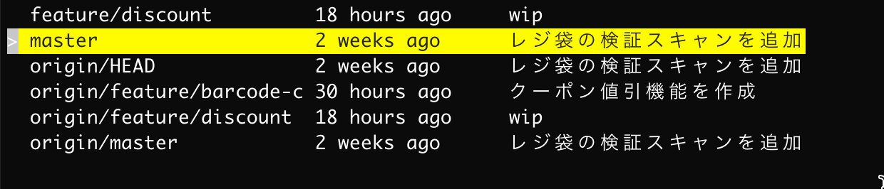

git-branch-selector
~~~~~~~~~~~~~~~~~~~

.. image:: https://img.shields.io/pypi/v/git-branch-selector.svg
    :target: https://pypi.python.org/pypi/git-branch-selector/
    :alt: Latest PyPI version

Install
-------
::

  pip install git-branch-selector

or

::

  python3 -m pip install git-branch-selector

Usage
-----

::

  git-branch-selector

- arrow-up / down / j / k to move cursor
- enter to select branch
- q to quit
- ctrl-c to quit
